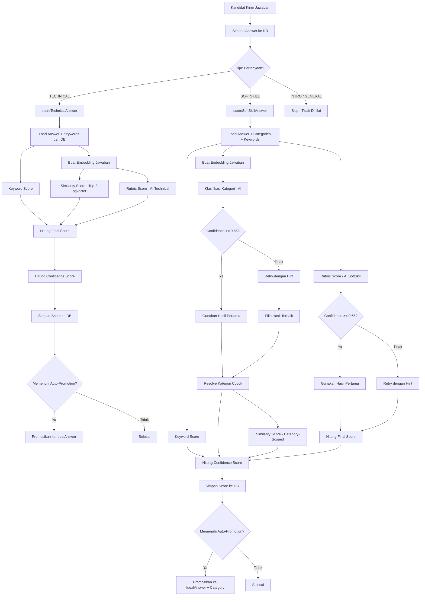

# 🧮 Scoring Pipeline — Wawancara AI
## Alur Proses Penilaian Jawaban dari Awal Hingga Akhir

---

## 🎯 Mengapa Sistem Scoring Ini Dirancang Demikian?

Bagian ini menjelaskan **alasan teknis dan konseptual** di balik setiap keputusan desain scoring — mulai dari pemilihan komponen, penetapan bobot, hingga mekanisme pendukungnya.

---

### 1. Mengapa Hybrid Scoring? (bukan hanya satu metode)

Menilai jawaban wawancara dengan **satu metode tunggal** menghasilkan evaluasi yang tidak adil:

| Masalah Satu Metode | Dampak |
|---|---|
| Hanya AI rubric | Subjektif terhadap cara penulisan, bisa terkecoh jawaban yang terdengar bagus tapi kosong substansi |
| Hanya keyword matching | Kandidat yang paham konsep tapi menggunakan sinonim/parafrase bisa dirugikan |
| Hanya semantic similarity | Jawaban generik yang "mirip" secara semantik bisa mendapat skor tinggi meski kurang tepat |

**Solusi → Hybrid Scoring:** menggabungkan tiga sudut pandang berbeda yang saling melengkapi dan mengkoreksi satu sama lain:

```
Rubric AI   → "Apakah jawaban ini BENAR secara konsep?"
Similarity  → "Apakah jawaban ini MIRIP dengan jawaban ideal?"
Keyword     → "Apakah jawaban ini MENCAKUP poin-poin kunci?"
```

Setiap komponen menangkap dimensi kualitas yang berbeda. Ketiganya bersama-sama memberikan penilaian yang lebih **robust, adil, dan tahan terhadap gaming**.

---

### 2. Mengapa Rubric AI Diberi Bobot Tertinggi?

**Technical: 50% | SoftSkill: 40%**

Rubric AI menilai **kedalaman pemahaman** — sesuatu yang tidak bisa diukur oleh keyword matching maupun similarity semata. AI yang diberi rubrik terstruktur:

- Bisa mendeteksi **kesalahan konseptual** meski jawaban terdengar relevan
- Bisa menghargai **penalaran logis** meski menggunakan kata-kata berbeda
- Bisa menilai **kualitas komunikasi** sebagai kemampuan tersendiri

Contoh kasus nyata:

> **Pertanyaan:** "Apa itu JWT?"
>
> **Jawaban A:** *"JWT adalah JSON Web Token yang digunakan untuk autentikasi stateless dengan tiga bagian: header, payload, signature."*
> → Rubric: tinggi ✅ — benar, lengkap, terstruktur
>
> **Jawaban B:** *"JWT itu kayak token gitu buat login biar bisa masuk aplikasi."*
> → Rubric: rendah ⚠️ — relevan tapi dangkal, tidak menunjukkan pemahaman

Keyword dan similarity mungkin tidak cukup membedakan A dan B, tapi rubric AI bisa.

> Bobot lebih rendah untuk SoftSkill (40% vs 50%) karena penilaian softskill lebih subjektif — rubric perlu "dikalibrasi" oleh komponen lain seperti Category Score.

---

### 3. Mengapa Menggunakan Cosine Similarity dengan Embedding?

Keyword matching bersifat **leksikal** — hanya mengenali kata yang persis sama. Ini gagal menangkap:

- **Sinonim:** "bertanggung jawab" ≈ "accountable" ≈ "dapat diandalkan"
- **Parafrase:** "saya sering memimpin tim" ≈ "saya biasanya jadi ketua kelompok"
- **Konsep implisit:** kandidat menjelaskan konsep tanpa menyebut nama teknisnya

**Embedding + Cosine Similarity** menyelesaikan ini dengan merepresentasikan teks sebagai **vektor semantik** di ruang 3072 dimensi. Teks yang bermakna mirip akan memiliki vektor yang berdekatan, terlepas dari perbedaan kata yang digunakan.

```
"Saya pernah memimpin proyek akhir di kampus" 
        ↓ [text-embedding-3-large]
vector: [0.021, -0.143, 0.089, ..., 0.062]  (3072 nilai)

cosine_similarity(jawaban_user, ideal_answer) → 0.87
→ "Sangat mirip secara makna"
```

**Mengapa top-3 average, bukan top-1?**

Menggunakan rata-rata tiga kemiripan terdekat membuat scoring:
- Lebih **stabil** — tidak bergantung pada satu referensi saja
- Lebih **representatif** — mencerminkan konsensus dari beberapa jawaban ideal
- Lebih **toleran** terhadap variasi gaya penulisan dalam referensi

**Mengapa OpenAI `text-embedding-3-large` (3072 dimensi)?**

Model ini memiliki kemampuan representasi semantik yang superior, khususnya untuk teks bahasa Indonesia campuran technical terms — sehingga lebih akurat dalam menangkap nuansa makna jawaban kandidat.

---

### 4. Mengapa Keyword Score Tetap Dipakai Meski Ada Similarity?

Similarity mengukur kemiripan *keseluruhan makna*, bukan **kehadiran poin spesifik** yang kritis. Sebuah jawaban bisa terdengar bagus secara umum tapi melewatkan term teknis yang penting:

> **Pertanyaan:** "Jelaskan perbedaan SQL dan NoSQL"
>
> **Jawaban yang tidak menyebut kata "schema", "scalability", atau "ACID":**
> → Similarity mungkin tetap tinggi karena konteks mirip
> → Keyword Score akan rendah karena poin kunci hilang ✅ (benar dihukum)

Keyword score juga berfungsi sebagai **signal eksplisit** bahwa kandidat menguasai terminologi domain — penting untuk posisi teknis.

**Formula hybrid keyword score lebih adil dari sekedar count:**
```
keywordScore = weightCoverage × 0.70 + countCoverage × 0.30
```
- Keyword berbobot tinggi yang ditemukan → reward lebih besar
- Tidak hanya menghitung berapa banyak, tapi **mana yang lebih penting** yang ditemukan

---

### 5. Mengapa Category Score Ada di SoftSkill? (bukan di Technical)

Pertanyaan soft skill **tidak memiliki satu jawaban benar** — ada spektrum jawaban yang semuanya valid tapi menunjukkan tingkat kapabilitas berbeda.

Contoh: *"Seberapa sering kamu memimpin tim?"*

| Jawaban | Kategori | Score |
|---|---|---|
| "Sangat sering, saya selalu jadi ketua" | Sangat sering | 5 |
| "Beberapa kali di proyek kelompok" | Sering | 4 |
| "Jarang, saya lebih suka anggota" | Jarang | 3 |
| "Belum pernah sama sekali" | Tidak pernah | 2 |

**Category Score mengkuantifikasi posisi jawaban dalam spektrum ini** secara normatif — sesuatu yang tidak bisa dilakukan similarity atau keyword secara akurat.

> Formula: `categoryScore = matchedCategory.score / maxCategoryScore`
> Ini memastikan skor selalu dalam konteks: nilai tertinggi yang mungkin untuk pertanyaan itu = 1.0

---

### 6. Mengapa Category-Scoped Similarity untuk SoftSkill?

Jika similarity dibandingkan terhadap **semua** IdealAnswer tanpa filter kategori, maka:

> Jawaban "Saya jarang memimpin" bisa dianggap mirip dengan jawaban ideal "Saya sangat sering memimpin" hanya karena membahas topik yang sama (kepemimpinan).

Dengan **Category-Scoped Similarity**, jawaban dibandingkan hanya dengan referensi yang **berada di kategori yang sama** — memastikan perbandingan semantik yang adil dan bermakna:

```
"Jarang memimpin" → dibandingkan dengan referensi "Jarang" (bukan "Sangat sering")
→ Similarity tinggi ✅ (perbandingan yang tepat)
```

**Cold-start fallback** (question-wide) mencegah sistem crash saat kategori baru belum memiliki referensi.

---

### 7. Mengapa Bobot Komponen Dirancang Seperti Ini?

#### Technical Scoring (Rubric 50% | Similarity 30% | Keyword 20%)

```
Technical = domain knowledge yang terverifikasi
→ Rubric AI sebagai "hakim utama" (50%)
→ Similarity sebagai validasi semantik (30%)
→ Keyword sebagai checklist terminologi (20%)
```

Rubric mendapat bobot terbesar karena untuk pertanyaan teknis, **kebenaran konseptual adalah yang paling kritis**. Similarity dan keyword hanya memperkuat atau mengoreksi rubric.

#### SoftSkill Scoring (Rubric 40% | Category 30% | Similarity 20% | Keyword 10%)

```
SoftSkill = perilaku & kepribadian yang tidak hitam-putih
→ Rubric AI menilai kualitas komunikasi (40%)
→ Category Score menentukan "level" jawaban secara normatif (30%)
→ Similarity memvalidasi relevansi semantik per kategori (20%)
→ Keyword sebagai signal minimal (10%)
```

Keyword mendapat bobot paling kecil (10%) untuk softskill karena jawaban perilaku yang baik tidak harus menggunakan terminologi tertentu.

---

### 8. Mengapa Ada Retry Mechanism? (threshold 0.65)

AI bisa menghasilkan penilaian yang **tidak yakin** — terutama untuk:
- Jawaban yang ambigu atau singkat
- Jawaban yang membahas topik tapi tidak eksplisit menjawab
- Jawaban dalam bahasa yang campur (Indonesia + Inggris teknis)

Jika confidence AI < 0.65 (threshold `LOW_CONFIDENCE_THRESHOLD`), artinya AI sendiri tidak yakin dengan hasilnya. Menggunakan hasil yang tidak yakin akan menghasilkan skor yang tidak akurat.

**Retry dengan `retryHint`** memaksa AI untuk:
- Fokus hanya pada **bukti eksplisit** dalam teks jawaban
- Tidak berasumsi atau mengisi kekosongan dengan inferensi
- Memberikan penilaian yang lebih konservatif dan dapat dipertanggungjawabkan

`pickBetterResult` memilih hasil dengan confidence tertinggi — bukan selalu hasil retry, melainkan yang **paling yakin** dari dua percobaan.

> **Mengapa 0.65, bukan 0.70 atau 0.50?**
> 0.65 adalah titik tengah yang pragmatis: cukup tinggi untuk memastikan kualitas, tapi tidak terlalu tinggi sehingga hampir selalu retry (yang mahal secara API dan latency).

---

### 9. Mengapa Auto-Promotion Membutuhkan 4 Gate?

Auto-promotion secara otomatis menambah basis pengetahuan referensi. Jika standarnya terlalu longgar, jawaban berkualitas rendah akan mencemari referensi dan menurunkan akurasi scoring semua kandidat berikutnya.

| Gate | Alasan |
|---|---|
| `finalScore ≥ 85` | Jawaban memang bagus secara keseluruhan |
| `confidenceScore ≥ 0.85` | Sistem yakin dengan penilaiannya — bukan hasil yang meragukan |
| `similarityScore ≥ 0.80` | Jawaban sudah cukup mirip dengan referensi yang ada (berkualitas sesuai standar) |
| `rubricScore ≥ 0.80` | Jawaban benar secara konseptual — bukan hanya kebetulan mirip secara semantik |

Untuk SoftSkill, ada gate ke-5: `existingSimilarity < 0.95` — mencegah jawaban yang hampir identik dengan referensi yang ada ditambahkan (menghindari bloat dan duplikasi yang tidak berguna).

**Manfaat Auto-Promotion:**
- Basis referensi terus berkembang secara organik dari jawaban kandidat terbaik
- Similarity score semakin akurat seiring waktu karena referensi makin beragam
- Sistem belajar sendiri tanpa intervensi manual admin

---

### 10. Mengapa Scoring Berjalan Async (Background)?

Proses scoring melibatkan:
1. Panggilan API OpenAI (embedding + rubric) — latensi 1-5 detik
2. Query pgvector similarity — millisecond, tapi blocking
3. Potensi retry jika confidence rendah — menambah latensi

Jika scoring dilakukan **sinkron** (blocking), kandidat harus menunggu 3-10 detik setelah setiap jawaban sebelum pertanyaan berikutnya muncul — merusak pengalaman wawancara yang seharusnya natural dan mengalir.

Dengan **async scoring**:
- Pertanyaan berikutnya langsung dikirim setelah jawaban disimpan
- Scoring berjalan di background tanpa memblokir UI
- Hasil skor tersedia saat kandidat membuka halaman result setelah interview selesai

---

### Ringkasan Justifikasi Desain

| Keputusan Desain | Alasan Utama |
|---|---|
| **Hybrid 3-4 komponen** | Setiap metode tunggal memiliki blind spot; kombinasi lebih robust |
| **Rubric sebagai komponen dominan** | Menilai kedalaman pemahaman, tidak bisa digantikan similarity/keyword |
| **Embedding + pgvector** | Menangkap kemiripan semantik lintas parafrase dan sinonim |
| **Top-3 average similarity** | Lebih stabil dan representatif dari satu referensi saja |
| **Keyword score sebagai checklist** | Memastikan terminologi kunci hadir — signal domain expertise |
| **Category Score di SoftSkill** | Mengkuantifikasi posisi jawaban dalam spektrum normatif |
| **Category-scoped similarity** | Perbandingan yang adil — hanya vs referensi sekategori |
| **Retry jika confidence < 0.65** | Menolak penilaian AI yang tidak yakin; meningkatkan akurasi |
| **4-5 gate auto-promotion** | Menjaga kualitas basis referensi agar tidak terdegradasi |
| **Async scoring** | Menjaga UX interview tetap natural dan tidak terputus |

---

## Gambaran Umum

Sistem scoring berjalan **secara background (async)** setelah jawaban kandidat tersimpan. Penilaian dibagi menjadi dua jalur terpisah berdasarkan tipe pertanyaan:

- **Technical Scoring** → untuk pertanyaan tipe `TECHNICAL`
- **Soft Skill Scoring** → untuk pertanyaan tipe `SOFTSKILL`

Pertanyaan `INTRO` dan `GENERAL` **tidak dinilai**.

---

## Diagram Alur Keseluruhan



---

## Komponen 1: Keyword Score

**File:** [`src/utils/calculteKeywordScore.ts`](src/utils/calculteKeywordScore.ts)

### Alur Kerja

```
Jawaban User (text)
        ↓
[Normalize Text] → lowercase, hapus karakter khusus
        ↓
[Ambil Top-5 Keyword berdasarkan weight tertinggi]
        ↓
Untuk setiap keyword:
  → [hasWholeWord]: cek kemunculan kata dalam jawaban
    1. Exact whole-word regex match
    2. Fallback: substring match
    3. Fallback: multi-word parts match
  → Jika match: matchedWeight += keyword.weight
                 matchedCount += 1
        ↓
weightCoverage = matchedWeight / totalCoreWeight
countCoverage  = matchedCount  / jumlah_keyword
        ↓
keywordScore   = min(1, weightCoverage × 0.7 + countCoverage × 0.3)
```

### Detail Formula

| Komponen | Bobot | Penjelasan |
|---|---|---|
| `weightCoverage` | 70% | Rasio bobot keyword yang ditemukan vs total bobot |
| `countCoverage` | 30% | Rasio jumlah keyword yang ditemukan vs total keyword |

**Output:** Nilai `keywordScore` dalam rentang **0 – 1**

---

## Komponen 2: Similarity Score (Cosine Similarity)

**File:** [`src/services/question.service.ts`](src/services/question.service.ts)

### Alur Kerja

```
Jawaban User (text)
        ↓
[createEmbedding] → OpenAI text-embedding-3-large (3072 dimensi)
        ↓
Vector Embedding Jawaban User
        ↓
[pgvector Query] → Cari top-3 IdealAnswer terdekat
  SQL: 1 - (embedding <=> userVector)::vector AS cosine_similarity
  ORDER BY embedding <=> userVector ASC LIMIT 3
        ↓
Average dari top-3 nilai cosine_similarity
        ↓
similarityScore = clamp(average, 0, 1)
```

### Dua Mode Similarity

#### Mode A: Question-Wide (Technical)
```sql
SELECT 1 - (embedding <=> [userVector]::vector) AS cosine_similarity
FROM "IdealAnswer"
WHERE "questionId" = ?
ORDER BY embedding <=> [userVector]::vector ASC
LIMIT 3
```

#### Mode B: Category-Scoped (SoftSkill)
```sql
-- Prioritas: filter berdasarkan kategori yang sama
SELECT 1 - (embedding <=> [userVector]::vector) AS cosine_similarity
FROM "IdealAnswer"
WHERE "questionId" = ? AND "answerCategoryId" = ?
ORDER BY embedding <=> [userVector]::vector ASC
LIMIT 3

-- Cold-start fallback: jika tidak ada IdealAnswer untuk kategori ini,
-- gunakan question-wide lookup
```

### Cosine Similarity

```
cosine_similarity(A, B) = (A · B) / (||A|| × ||B||)

pgvector operator (<=>): L2 distance
→ Dikonversi: cosine_similarity = 1 - (A <=> B)
```

**Output:** Nilai `similarityScore` dalam rentang **0 – 1**

---

## Komponen 3A: Rubric Score — Technical

**File:** [`src/services/ai.service.ts`](src/services/ai.service.ts) → `buildTechnicalRubricPrompt()`

### Alur Kerja

```
(questionText, userAnswer, questionCategoryName?)
        ↓
[Langkah 1 — Cek relevansi]
  → Apakah jawaban berkaitan dengan topik questionCategoryName?
  → TIDAK berkaitan → semua rubrik = 0, confidence rendah (0.1–0.3)
  → BERKAITAN → lanjut ke Langkah 2
        ↓
[Langkah 2 — OpenAI GPT] dengan prompt rubrik teknis (Bahasa Indonesia)
        ↓
JSON Response:
{
  "understanding": 0-5,
  "technicalAccuracy": 0-5,
  "problemSolving": 0-5,
  "technicalCommunication": 0-5,
  "confidence": 0-1,
  "reason": "alasan singkat — relevansi + justifikasi skor"
}
        ↓
[Retry jika confidence < 0.65]
  → Kirim ulang dengan retryHint:
    "Penilaian sebelumnya kurang yakin. Fokus pada bukti teknis eksplisit dalam jawaban."
  → Pilih hasil terbaik (confidence lebih tinggi)
        ↓
rubricScore = (understanding + technicalAccuracy + problemSolving + technicalCommunication) / 20
```

### Rubrik Penilaian Technical

| Kriteria | Rentang | Deskripsi |
|---|---|---|
| `understanding` | 0–5 | Kedalaman pemahaman konsep yang ditunjukkan dalam jawaban |
| `technicalAccuracy` | 0–5 | Kebenaran detail teknis, terminologi, dan fakta yang digunakan |
| `problemSolving` | 0–5 | Kualitas penalaran logis dan pendekatan dalam menyelesaikan masalah |
| `technicalCommunication` | 0–5 | Kejelasan dan ketepatan dalam menjelaskan konsep teknis |

> **Catatan:** Nilai 0 diberikan jika jawaban **tidak relevan** dengan topik kategori pertanyaan (`questionCategoryName`).

**Formula:**
```
rubricScore = (understanding + technicalAccuracy + problemSolving + technicalCommunication) / 20
→ Rentang 0 – 1
```

---

## Komponen 3B: Rubric Score — SoftSkill

**File:** [`src/services/ai.service.ts`](src/services/ai.service.ts) → `buildSoftSkillRubricPrompt()`

### Alur Kerja

```
(questionText, userAnswer, questionCategoryName?)
        ↓
[Langkah 1 — Cek relevansi]
  → Apakah jawaban berkaitan dengan topik questionCategoryName?
  → TIDAK berkaitan → semua rubrik = 0, confidence rendah (0.1–0.3)
  → BERKAITAN → lanjut ke Langkah 2
        ↓
[Langkah 2 — OpenAI GPT] dengan prompt rubrik soft skill
        ↓
JSON Response:
{
  "communication": 0-5,
  "selfAwareness": 0-5,
  "behaviorEvidence": 0-5,
  "growthMindset": 0-5,
  "confidence": 0-1,
  "reason": "alasan singkat — relevansi + justifikasi skor"
}
        ↓
[Retry jika confidence < 0.65]
  → retryHint: "Penilaian sebelumnya kurang meyakinkan. Fokus pada bukti eksplisit komunikasi, kesadaran diri, dan relevansi."
        ↓
rubricScore = (communication + selfAwareness + behaviorEvidence + growthMindset) / 20
```

### Rubrik Penilaian SoftSkill

| Kriteria | Rentang | Deskripsi |
|---|---|---|
| `communication` | 0–5 | Kejelasan dan struktur penyampaian jawaban |
| `selfAwareness` | 0–5 | Pemahaman kandidat terhadap kelebihan dan keterbatasan diri |
| `behaviorEvidence` | 0–5 | Ada tidaknya contoh perilaku konkret di masa lalu |
| `growthMindset` | 0–5 | Kesadaran terhadap area pengembangan dan keinginan belajar |

> **Catatan:** Nilai 0 diberikan jika jawaban **tidak relevan** dengan topik kategori pertanyaan (`questionCategoryName`).

**Formula:**
```
rubricScore = (communication + selfAwareness + behaviorEvidence + growthMindset) / 20
→ Rentang 0 – 1
```

---

## Komponen 4: Klasifikasi Kategori (khusus SoftSkill)

**File:** [`src/services/ai.service.ts`](src/services/ai.service.ts) → `buildSoftSkillClassificationPrompt()`

### Alur Kerja

```
(questionText, userAnswer, daftar_kategori)
        ↓
[OpenAI GPT] → Pilih SATU kategori dari daftar tersedia
  (+ escape-hatch: "Tidak ada kategori yang sesuai", score: 0)
        ↓
JSON Response:
{
  "categoryId": nomor_urut,
  "label": "label persis seperti dalam daftar",
  "confidence": 0-1,
  "reason": "alasan singkat"
}
        ↓
[Retry jika confidence < 0.65]
  → retryHint: "Pilih berdasarkan bukti eksplisit. Jangan membuat asumsi."
        ↓
[Resolve Kategori Cocok]:
  1. Exact match (case-insensitive) terhadap label di DB
  2. Fuzzy match (stringSimilarity ≥ 0.4):
     - Exact: label = label → similarity 1.0
     - Substring: "A" ⊂ "B" atau sebaliknya → similarity 0.9
     - Word Jaccard: |intersection(words)| / |union(words)|
  3. Fallback: Uncategorized (score: 0)
        ↓
categoryScore = matchedCategory.score / maxCategoryScore
→ Rentang 0 – 1
```

### Contoh Kategori SoftSkill

```
Pertanyaan: "Bagaimana kamu beradaptasi dengan aturan di tempat magang?"
Kategori tersedia:
  1. Mudah Beradaptasi       (score: 4)
  2. Bisa Beradaptasi        (score: 3)
  3. Sulit Beradaptasi       (score: 2)
  4. Tidak Mau Beradaptasi   (score: 1)

Jika AI mengklasifikasikan: "Mudah Beradaptasi" (score: 4)
maxCategoryScore = 4
categoryScore = 4 / 4 = 1.0

Jika AI mengklasifikasikan: "Bisa Beradaptasi" (score: 3)
categoryScore = 3 / 4 = 0.75
```

---

## Retry Mechanism

**File:** [`src/utils/retryIfLowConfidenceWithPrompt.ts`](src/utils/retryIfLowConfidenceWithPrompt.ts)

### Alur Kerja

```
Threshold: LOW_CONFIDENCE_THRESHOLD = 0.65

[Request AI Pertama]
        ↓
confidence = clamp(result.confidence, 0, 1)
        ↓
confidence >= 0.65?
  ├─ Ya  → Gunakan hasil pertama, prompt = promptNormal
  └─ Tidak → [Retry Request dengan retryHint]
                  ↓
             [pickBetterResult]:
               Bandingkan confidence pertama vs retry
               Pilih yang confidence-nya lebih tinggi
                  ↓
             Kembalikan { result: terbaik, prompt: promptRetry }
```

---

## Final Score — Technical

**File:** [`src/services/scoring.service.ts`](src/services/scoring.service.ts) → `scoreTechnicalAnswer()`

### Formula

```
finalScore (0–100) =
  (rubricScore × 0.50 + similarityScore × 0.30 + keywordScore × 0.20) × 100

confidenceScore (0–1) =
  (aiConfidence + similarityScore + keywordScore) / 3
```

### Bobot Komponen

| Komponen | Bobot | Sumber |
|---|---|---|
| `rubricScore` | **50%** | AI evaluasi 4 rubrik teknis (masing-masing 0–5, dibagi 20) |
| `similarityScore` | **30%** | Rata-rata cosine similarity top-3 vs IdealAnswer (pgvector) |
| `keywordScore` | **20%** | Coverage kata kunci berbobot (matchedWeight / totalWeight) |

### Feedback

| Range finalScore | Feedback |
|---|---|
| ≥ 75 | "Jawaban sangat baik" |
| ≥ 50 | "Jawaban cukup baik" |
| < 50 | "Jawaban perlu diperbaiki" |

---

## Final Score — SoftSkill

**File:** [`src/services/scoring.service.ts`](src/services/scoring.service.ts) → `scoreSoftSkillAnswer()`

### Formula

```
finalScore (0–100) =
  (rubricScore × 0.40 + categoryScore × 0.30 + similarityScore × 0.20 + keywordScore × 0.10) × 100

confidenceScore (0–1) =
  (aiCategoryConfidence × 0.40 + aiRubricConfidence × 0.30 + similarityScore × 0.20 + keywordScore × 0.10)
```

### Bobot Komponen

| Komponen | Bobot | Sumber |
|---|---|---|
| `rubricScore` | **40%** | AI evaluasi 4 rubrik soft skill (masing-masing 0–5, dibagi 20) |
| `categoryScore` | **30%** | Skor kategori terklasifikasi / maxCategoryScore |
| `similarityScore` | **20%** | Rata-rata cosine similarity top-3 vs IdealAnswer (category-scoped) |
| `keywordScore` | **10%** | Coverage kata kunci berbobot |

---

## Auto-Promotion to Ideal Answer

Jawaban kandidat **otomatis dipromosikan** sebagai `IdealAnswer` baru jika memenuhi **semua 4 syarat**:

### Syarat Technical
| Gate | Threshold |
|---|---|
| `finalScore` | ≥ 85 |
| `confidenceScore` | ≥ 0.85 |
| `similarityScore` | ≥ 0.80 |
| `rubricScore` | ≥ 0.80 |

### Syarat SoftSkill (tambahan: duplikasi check)
| Gate | Threshold |
|---|---|
| `existingSimilarity` | **< 0.95** (cegah duplikat) |
| `finalScore` | ≥ 85 |
| `confidenceScore` | ≥ 0.85 |
| `similarityScore` | ≥ 0.80 |
| `rubricScore` | ≥ 0.80 |

### Proses Promosi

```
Jawaban lulus semua gate
        ↓
[createEmbedding] → hitung vector embedding jawaban
        ↓
[Cek duplikat] → apakah konten persis sudah ada di DB?
  └─ Jika sudah ada → return existing (skip)
        ↓
[INSERT IdealAnswer]:
  - questionId
  - answerCategoryId (SoftSkill only)
  - content
  - embedding (vector 3072 dimensi)
  - sourceAnswerId (SoftSkill only — link ke answer asal)
        ↓
[Log] → "[Auto-Promotion] Softskill answer promoted to ReferenceAnswer"
```

---

## Alur Lengkap Technical Scoring (Step-by-Step)

```
Step 1: Load answer dengan include category + keywords dari DB
Step 2: Guard — skip jika bukan TECHNICAL
Step 3: Keyword Score
  → calculateKeywordScore(userAnswer, keywords)
  → Output: keywordScore (0–1)
Step 4: Buat Embedding
  → createEmbedding(userAnswer) via OpenAI text-embedding-3-large
  → Output: userEmbedding (number[], 3072 dim)
Step 5: Similarity Score
  → getTop3SimilarityAverage(userEmbedding, questionId)
  → Query pgvector top-3, ambil rata-rata
  → Output: similarityScore (0–1)
Step 6: Rubric Score (dengan retry jika confidence < 0.65)
  → generateTechnicalRubricScore(questionText, userAnswer, questionCategoryName)
  → Langkah 1: AI cek relevansi jawaban dengan topik questionCategoryName
    - Tidak relevan → semua rubrik = 0, confidence rendah
    - Relevan → lanjut penilaian
  → AI menilai: understanding, technicalAccuracy, problemSolving, technicalCommunication (0–5)
  → rubricScore = (sum of 4 criteria) / 20
  → Output: rubricScore (0–1), aiConfidence (0–1)
Step 7: Final Score
  → finalScore = (rubricScore×0.50 + similarityScore×0.30 + keywordScore×0.20) × 100
Step 8: Confidence Score
  → confidenceScore = (aiConfidence + similarityScore + keywordScore) / 3
Step 9: Feedback
  → "Jawaban sangat baik" / "cukup baik" / "perlu diperbaiki"
Step 10: Build breakdown object
Step 11: Upsert score ke DB
Step 12: Auto-Promotion check
  → Jika finalScore≥85 & confidenceScore≥0.85 & similarityScore≥0.8 & rubricScore≥0.8
  → addIdealAnswer(questionId, content)
```

---

## Alur Lengkap SoftSkill Scoring (Step-by-Step)

```
Step 1: Load answer dengan include category + categories + keywords dari DB
Step 2: Guard — skip jika bukan SOFTSKILL
Step 3: Guard — skip jika tidak ada AnswerCategory terdefinisi
Step 4: Keyword Score
  → calculateKeywordScore(userAnswer, keywords)
  → Output: keywordScore (0–1)
Step 5: Buat Embedding (early, untuk efisiensi)
  → createEmbedding(userAnswer)
  → Output: userEmbedding (number[], 3072 dim)
Step 6: Klasifikasi Kategori (dengan retry jika confidence < 0.65)
  → classifySoftSkillAnswer(questionText, userAnswer, categoryOptions, questionCategoryName)
  → AI memilih SATU kategori dari daftar tersedia
  → Output: classification { label, confidence, reason }
Step 7: Rubric Score (dengan retry jika confidence < 0.65)
  → generateSoftSkillRubricScore(questionText, userAnswer, questionCategoryName)
  → Langkah 1: AI cek relevansi jawaban dengan topik questionCategoryName
    - Tidak relevan → semua rubrik = 0, confidence rendah
    - Relevan → lanjut penilaian
  → AI menilai: communication, selfAwareness, behaviorEvidence, growthMindset (0–5)
  → rubricScore = (sum of 4 criteria) / 20
  → Output: rubricScore (0–1), aiRubricConfidence (0–1)
Step 8: Resolve Kategori Cocok
  a. Exact match (case-insensitive)
  b. Fuzzy match (stringSimilarity ≥ 0.4)
  c. Fallback: Uncategorized (score: 0)
Step 9: Category Score
  → maxCategoryScore = max(semua category.score)
  → categoryScore = matchedCategory.score / maxCategoryScore
Step 10: Similarity Score (Category-Scoped)
  → Jika matchedCategory.id valid:
      getTop3SimilarityAverageByCategory(embedding, questionId, categoryId)
    Else (cold-start):
      getTop3SimilarityAverage(embedding, questionId)
  → Output: similarityScore (0–1)
Step 11: Final Score
  → finalScore = (rubricScore×0.40 + categoryScore×0.30 + similarityScore×0.20 + keywordScore×0.10) × 100
Step 12: Confidence Score
  → confidenceScore = aiCategoryConfidence×0.40 + aiRubricConfidence×0.30 + similarityScore×0.20 + keywordScore×0.10
Step 13: Feedback
  → "Jawaban sangat baik" / "cukup baik" / "perlu diperbaiki"
Step 14: Build breakdown object
Step 15: Upsert score ke DB (+ categoryId, categoryLabel)
Step 16: Auto-Promotion check
  → Hitung ulang existingSimilarity (category-scoped)
  → Jika existingSimilarity<0.95 & finalScore≥85 & confidenceScore≥0.85 & similarityScore≥0.8 & rubricScore≥0.8
  → addIdealAnswer(questionId, content, categoryId, answerId)
```

---

## Ringkasan Data yang Disimpan di Tabel Score

| Field | Technical | SoftSkill | Keterangan |
|---|---|---|---|
| `type` | `TECHNICAL` | `SOFTSKILL` | Tipe scoring |
| `finalScore` | ✅ | ✅ | Skor akhir 0–100 |
| `rubricScore` | ✅ | ✅ | Skor rubrik AI 0–1 |
| `similarityScore` | ✅ | ✅ | Cosine similarity 0–1 |
| `keywordScore` | ✅ | ✅ | Keyword coverage 0–1 |
| `confidenceScore` | ✅ | ✅ | Keyakinan penilaian 0–1 |
| `categoryId` | ❌ | ✅ | ID AnswerCategory |
| `categoryLabel` | ❌ | ✅ | Label kategori |
| `feedback` | ✅ | ✅ | Teks feedback singkat |
| `reason` | ✅ | ✅ | Detail alasan skor |
| `prompt` | ✅ | ✅ | Prompt AI yang digunakan |
| `breakdown` | ✅ | ✅ | JSON detail sub-skor |

---

## Glosarium Komponen Scoring

| Istilah | Definisi |
|---|---|
| **Keyword Score** | Skor cakupan kata kunci. Dihitung berdasarkan kemunculan kata kunci berbobot dalam jawaban. Formula hybrid: 70% weight-coverage + 30% count-coverage |
| **Similarity Score** | Skor kemiripan semantik. Rata-rata cosine similarity dari 3 IdealAnswer terdekat menggunakan pgvector. Untuk SoftSkill, dibatasi pada kategori yang sama (category-scoped) |
| **Rubric Score** | Skor rubrik AI. Rata-rata dari 4 sub-kriteria (masing-masing **0–5**), dinormalisasi menjadi 0–1 dengan membagi 20. Jika jawaban tidak relevan dengan topik question category, semua rubrik bernilai 0 |
| **Category Score** | (SoftSkill saja) Skor berdasarkan kategori yang diklasifikasikan AI. Dihitung sebagai skor_kategori / max_skor_kategori |
| **Confidence Score** | Tingkat keyakinan gabungan sistem terhadap hasil penilaian. Dihitung dari rata-rata tertimbang confidence AI dan komponen skor lainnya |
| **Auto-Promotion** | Mekanisme otomatis menjadikan jawaban berkualitas tinggi sebagai referensi baru (IdealAnswer). Dipicu saat finalScore ≥ 85, confidenceScore ≥ 0.85, similarityScore ≥ 0.80, dan rubricScore ≥ 0.80 |
| **Category-Scoped Similarity** | Pencarian IdealAnswer yang dibatasi pada kategori yang sama dengan jawaban yang diklasifikasikan, agar perbandingan semantik lebih adil |
| **Cold-Start Fallback** | Jika belum ada IdealAnswer untuk kategori tertentu, similarity search dilakukan secara question-wide (tanpa filter kategori) |
| **Retry Mechanism** | Jika confidence AI < 0.65, sistem mengirim ulang prompt ke AI dengan hint tambahan. Hasil terbaik (confidence tertinggi) yang digunakan |
| **Cosine Similarity** | Metrik kemiripan antar vektor berdasarkan sudut. Nilai 1.0 = identik, 0.0 = tidak ada kemiripan |
| **pgvector** | Ekstensi PostgreSQL untuk menyimpan dan query vektor. Operator `<=>` menghitung jarak L2 antar vektor |
| **Embedding** | Representasi teks dalam bentuk vektor numerik 3072 dimensi menggunakan OpenAI text-embedding-3-large |

---

## 🧮 Cara Kerja Penilaian: Simulasi Perhitungan (Walkthrough)

Untuk memperjelas bagaimana formula di atas diaplikasikan secara nyata, berikut adalah dua contoh simulasi perhitungan langkah-demi-langkah.

### 💻 Kasus 1: Penilaian Technical (TECHNICAL)

#### 📝 Data Input:
*   **Pertanyaan:** *"Jelaskan apa itu REST API!"*
*   **Jawaban Kandidat:** *"REST API adalah protokol web service yang berkomunikasi via HTTP. Dia bersifat stateless dan menggunakan method standar seperti GET, POST."*
*   **Daftar Keywords di DB:**
    1.  `HTTP` (weight: 5)
    2.  `stateless` (weight: 4)
    3.  `resource` (weight: 3)
    4.  `endpoint` (weight: 2)
    5.  `JSON` (weight: 1)
    *   *Total bobot keyword (`totalCoreWeight`) = 5 + 4 + 3 + 2 + 1 = 15*
    *   *Total jumlah keyword = 5*

---

#### 🔢 Langkah 1: Menghitung Keyword Score
Sistem mencari kata kunci dalam jawaban kandidat menggunakan regex (case-insensitive, whole-word):
*   `HTTP` → **Ditemukan!** (bobot: 5)
*   `stateless` → **Ditemukan!** (bobot: 4)
*   `resource` → Tidak ditemukan.
*   `endpoint` → Tidak ditemukan.
*   `JSON` → Tidak ditemukan.

**Kalkulasi:**
*   `matchedWeight` = $5 + 4 = 9$
*   `matchedCount` = $2$
*   `weightCoverage` = $\frac{9}{15} = 0.60$
*   `countCoverage` = $\frac{2}{5} = 0.40$
*   `keywordScore` = $(weightCoverage \times 0.70) + (countCoverage \times 0.30)$
*   `keywordScore` = $(0.60 \times 0.70) + (0.40 \times 0.30) = 0.42 + 0.12 = 0.54$

---

#### 🔢 Langkah 2: Menghitung Similarity Score
1.  Jawaban dikonversi menjadi embedding vektor 3072-dimensi.
2.  Sistem melakukan query pgvector untuk mencari 3 `IdealAnswer` terdekat untuk pertanyaan ini.
3.  Hasil query cosine similarity:
    *   Reference 1: `0.88`
    *   Reference 2: `0.85`
    *   Reference 3: `0.82`
*   `similarityScore` = $\frac{0.88 + 0.85 + 0.82}{3} = \mathbf{0.85}$

---

#### 🔢 Langkah 3: Menghitung Rubric Score (AI)
LLM menganalisis jawaban dan memberikan nilai rubrik (skala **0–5**):
*   `understanding`: 4
*   `technicalAccuracy`: 4
*   `problemSolving`: 3
*   `technicalCommunication`: 5
*   `aiConfidence`: `0.90` (di atas threshold 0.65, tidak perlu retry)

> Sebelum menilai rubrik, AI terlebih dahulu mengecek apakah jawaban relevan dengan topik `questionCategoryName` (question category). Karena jawaban relevan, penilaian dilanjutkan.

**Kalkulasi:**
*   `totalRubricPoints` = $4 + 4 + 3 + 5 = 16$ (dari max 20)
*   `rubricScore` = $\frac{16}{20} = \mathbf{0.80}$

---

#### 🔢 Langkah 4: Menghitung Skor Akhir (Final Score & Confidence)
Menggabungkan ketiga komponen sesuai bobot technical (**Rubric 50% | Similarity 30% | Keyword 20%**):

**Final Score:**
$$\text{finalScore} = (rubricScore \times 0.50 + similarityScore \times 0.30 + keywordScore \times 0.20) \times 100$$
$$\text{finalScore} = (0.80 \times 0.50 + 0.85 \times 0.30 + 0.54 \times 0.20) \times 100$$
$$\text{finalScore} = (0.40 + 0.255 + 0.108) \times 100$$
$$\text{finalScore} = 0.763 \times 100 = \mathbf{76.3}$$

**Confidence Score:**
$$\text{confidenceScore} = \frac{aiConfidence + similarityScore + keywordScore}{3}$$
$$\text{confidenceScore} = \frac{0.90 + 0.85 + 0.54}{3} = \frac{2.29}{3} = \mathbf{0.763}$$

---

#### 🔢 Langkah 5: Evaluasi Auto-Promotion
Sistem memeriksa gerbang auto-promotion:
*   `finalScore` ($76.3$) $\ge 85$? ❌ **Gagal**

**Hasil Akhir:** Skor **76.3** disimpan ke database dengan status feedback **"Jawaban sangat baik"** ($\ge 75$), namun **tidak dipromosikan** menjadi referensi ideal baru.

---

### 👥 Kasus 2: Penilaian Soft Skill (SOFTSKILL)

#### 📝 Data Input:
*   **Pertanyaan:** *"Ceritakan konflik yang pernah kamu hadapi di tim dan solusinya!"*
*   **Jawaban Kandidat:** *"Saya pernah beda pendapat dengan rekan tim soal arsitektur DB. Akhirnya saya ajak dia diskusi, kami bandingkan kelebihan-kekurangannya, lalu cari jalan tengah lewat musyawarah."*
*   **Keywords di DB:**
    1.  `diskusi` (weight: 3)
    2.  `jalan tengah` (weight: 2)
    3.  `musyawarah` (weight: 2)
    4.  `berantem` (weight: 1)
    *   *Total bobot keyword = 3 + 2 + 2 + 1 = 8*
    *   *Total jumlah keyword = 4*
*   **Kategori Jawaban (AnswerCategory) di DB:**
    *   Kategori A: `Kolaboratif & Solutif` (Score: 5)
    *   Kategori B: `Kompromi` (Score: 4)
    *   Kategori C: `Menghindari Konflik` (Score: 2)
    *   Kategori D: `Konfrontatif` (Score: 1)
    *   *Max Category Score = 5*

---

#### 🔢 Langkah 1: Menghitung Keyword Score
Pencarian kata kunci dalam jawaban:
*   `diskusi` → **Ditemukan!** (bobot: 3)
*   `jalan tengah` → **Ditemukan!** (bobot: 2)
*   `musyawarah` → **Ditemukan!** (bobot: 2)
*   `berantem` → Tidak ditemukan.

**Kalkulasi:**
*   `matchedWeight` = $3 + 2 + 2 = 7$
*   `matchedCount` = $3$
*   `weightCoverage` = $\frac{7}{8} = 0.875$
*   `countCoverage` = $\frac{3}{4} = 0.75$
*   `keywordScore` = $(0.875 \times 0.70) + (0.75 \times 0.30) = 0.6125 + 0.225 = \mathbf{0.8375}$

---

#### 🔢 Langkah 2: Klasifikasi Kategori (AI)
LLM menganalisis jawaban dan mencocokkannya ke salah satu kategori terdaftar:
*   AI Output: `Kolaboratif & Solutif`
*   `aiCategoryConfidence`: `0.92` (tidak perlu retry)
*   Sistem mencocokkan ke database dan mendapatkan ID Kategori A dengan score = 5.

**Kalkulasi:**
*   `categoryScore` = $\frac{\text{Skor Kategori}}{\text{Max Skor Kategori}} = \frac{5}{5} = \mathbf{1.0}$

---

#### 🔢 Langkah 3: Menghitung Similarity Score (Category-Scoped)
1.  Jawaban dikonversi menjadi embedding.
2.  Sistem mencari 3 `IdealAnswer` terdekat **yang juga berada di bawah kategori `Kolaboratif & Solutif`** (bukan kategori lain).
3.  Hasil query cosine similarity:
    *   Reference 1: `0.90`
    *   Reference 2: `0.87`
    *   Reference 3: `0.84`
*   `similarityScore` = $\frac{0.90 + 0.87 + 0.84}{3} = \mathbf{0.87}$

---

#### 🔢 Langkah 4: Menghitung Rubric Score (AI)
LLM memberikan skor kriteria soft skill (skala **0–5**):
*   `communication`: 4
*   `selfAwareness`: 4
*   `behaviorEvidence`: 5
*   `growthMindset`: 4
*   `aiRubricConfidence`: `0.88` (tidak perlu retry)

> Sebelum menilai rubrik, AI terlebih dahulu mengecek apakah jawaban relevan dengan topik `questionCategoryName`. Karena jawaban relevan, penilaian dilanjutkan.

**Kalkulasi:**
*   `totalRubricPoints` = $4 + 4 + 5 + 4 = 17$
*   `rubricScore` = $\frac{17}{20} = \mathbf{0.85}$

---

#### 🔢 Langkah 5: Menghitung Skor Akhir (Final Score & Confidence)
Menggabungkan keempat komponen sesuai bobot soft skill (**Rubric 40% | Category 30% | Similarity 20% | Keyword 10%**):

**Final Score:**
$$\text{finalScore} = (rubricScore \times 0.40 + categoryScore \times 0.30 + similarityScore \times 0.20 + keywordScore \times 0.10) \times 100$$
$$\text{finalScore} = (0.85 \times 0.40 + 1.0 \times 0.30 + 0.87 \times 0.20 + 0.8375 \times 0.10) \times 100$$
$$\text{finalScore} = (0.34 + 0.30 + 0.174 + 0.08375) \times 100$$
$$\text{finalScore} = 0.89775 \times 100 = \mathbf{89.78}$$

**Confidence Score:**
$$\text{confidenceScore} = (aiCategoryConfidence \times 0.40) + (aiRubricConfidence \times 0.30) + (similarityScore \times 0.20) + (keywordScore \times 0.10)$$
$$\text{confidenceScore} = (0.92 \times 0.40) + (0.88 \times 0.30) + (0.87 \times 0.20) + (0.8375 \times 0.10)$$
$$\text{confidenceScore} = 0.368 + 0.264 + 0.174 + 0.08375 = \mathbf{0.8898}$$

---

#### 🔢 Langkah 6: Evaluasi Auto-Promotion
Sistem memeriksa 5 gerbang auto-promotion untuk Soft Skill:
1.  `finalScore` ($89.78 \ge 85$)?  ✅ **Lolos**
2.  `confidenceScore` ($0.8898 \ge 0.85$)? ✅ **Lolos**
3.  `similarityScore` ($0.87 \ge 0.80$)? ✅ **Lolos**
4.  `rubricScore` ($0.85 \ge 0.80$)? ✅ **Lolos**
5.  `existingSimilarity` ($0.91 < 0.95$)? ✅ **Lolos** (Bukan duplikat persis dari referensi yang ada)

**Hasil Akhir:** Skor **89.78** disimpan ke database dengan status **"Jawaban sangat baik"**. Jawaban ini **lulus seluruh sensor** dan otomatis **dipromosikan** menjadi `IdealAnswer` baru untuk kategori `Kolaboratif & Solutif`.

