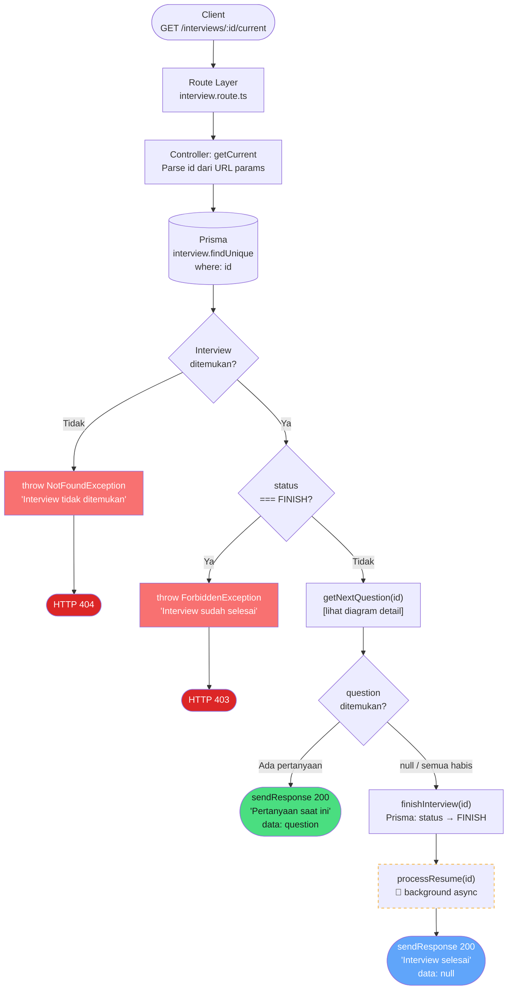
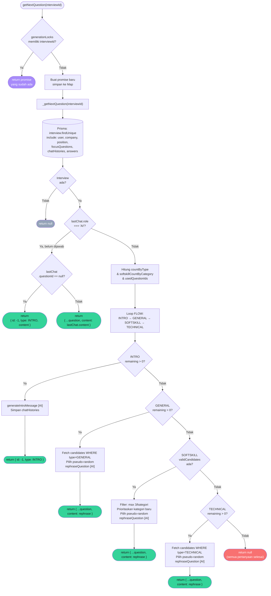

# Alur Logic: `GET /interviews/:id/current`

## Ringkasan

Endpoint ini digunakan untuk mengambil pertanyaan **saat ini** (current question) dari sebuah sesi interview yang sedang berjalan. Jika semua pertanyaan sudah terjawab, endpoint ini secara otomatis menyelesaikan (finish) interview tersebut.

---

## Informasi Endpoint

| Atribut       | Detail                                    |
|---------------|-------------------------------------------|
| **Method**    | `GET`                                     |
| **Path**      | `/interviews/:id/current`                 |
| **Route File**| `src/routes/interview.route.ts`           |
| **Controller**| `InterviewController.getCurrent`          |
| **Service**   | `interviewService.getInterviewById`, `interviewService.getNextQuestion`, `interviewService.finishInterview`, `interviewService.processResume` |

---

## Alur Logic

### Diagram Alur



---

### Detail: `interviewService.getNextQuestion(id)`

Fungsi ini menggunakan **generation lock** (`generationLocks` Map) untuk mencegah concurrent call menghasilkan pertanyaan duplikat.



---

## Distribusi Pertanyaan (`DISTRIBUTION`)

| Tipe         | Jumlah Maksimum                     |
|--------------|-------------------------------------|
| `INTRO`      | 1                                   |
| `GENERAL`    | 1                                   |
| `SOFTSKILL`  | `∞` (dikontrol per-kategori: max **3 per kategori**) |
| `TECHNICAL`  | 3                                   |

Urutan alur pertanyaan (FLOW): `INTRO → GENERAL → SOFTSKILL → TECHNICAL`

---

## Response

### Pertanyaan ditemukan (Interview masih berjalan)

```json
{
  "status": 200,
  "message": "Pertanyaan saat ini",
  "data": {
    "id": 42,
    "content": "Ceritakan pengalaman Anda menggunakan React hooks...",
    "type": "TECHNICAL",
    "categoryId": 3
  }
}
```

### Pertanyaan INTRO (belum pernah ada chat AI)

```json
{
  "status": 200,
  "message": "Pertanyaan saat ini",
  "data": {
    "id": -1,
    "content": "Halo Budi! Selamat datang di sesi interview...",
    "type": "INTRO"
  }
}
```

### Semua pertanyaan habis (Interview selesai otomatis)

```json
{
  "status": 200,
  "message": "Interview selesai",
  "data": null
}
```

---

## Error Cases

| Kondisi                              | Exception               | HTTP Status |
|--------------------------------------|-------------------------|-------------|
| `id` tidak ditemukan di database     | `NotFoundException`     | 404         |
| `interview.status === FINISH`        | `ForbiddenException`    | 403         |

---

## Side Effects

Ketika `getNextQuestion` mengembalikan `null` (semua soal habis):

1. **`finishInterview(id)`** — Update `interview.status` menjadi `FINISH` di database (operasi **sync**, ditunggu).
2. **`processResume(id)`** — Generate ringkasan interview menggunakan AI berdasarkan seluruh Q&A history (operasi **background/async**, error di-log ke `console.error` dan tidak memengaruhi response).

---

## File Terkait

| File | Deskripsi |
|------|-----------|
| [`src/routes/interview.route.ts`](../src/routes/interview.route.ts) | Definisi route |
| [`src/controller/interview.controller.ts`](../src/controller/interview.controller.ts) | Handler `getCurrent` (baris 61–91) |
| [`src/services/interview.service.ts`](../src/services/interview.service.ts) | `getNextQuestion` / `_getNextQuestion` (baris 144–334) |
